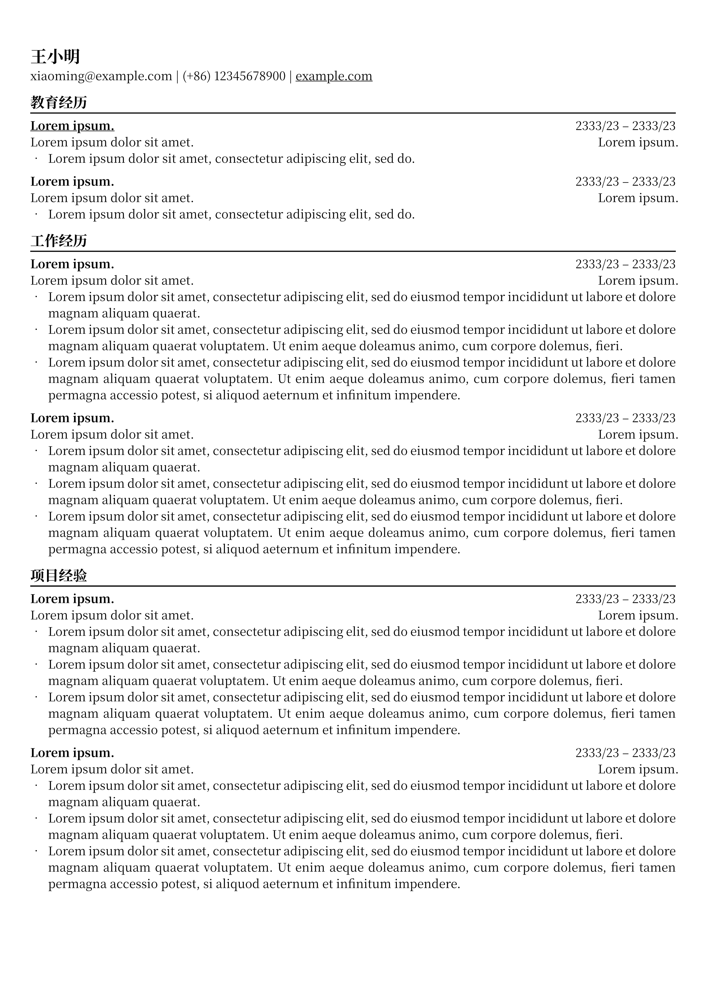

# Typst 简历模板

基于 [skyzh/chicv](https://github.com/skyzh/chicv) 制作

A simple CV template for [typst.app](https://typst.app).

## 如何使用

### 快速开始

在 [typst.app](https://typst.app) 创建一个项目, 把 https://github.com/JinBridger/chicv-cn/blob/master/template/cv.typ 里面的内容全部复制进去即可!

### 自定义你的简历

要更改文本大小，你可以在 `cv.typ` 文件中取消注释相应的行，并根据需要进行设置。（简历推荐的文本大小为10pt到12pt）

你还可以更改 `cv.typ` 文件中的页面边距，以便在单页中容纳更多内容。边距默认设置为 `(x: 0.9cm, y: 1.3cm)`。

每次打开新的部分时，别忘了包含 `#chiline()`，这行代码是一个完美的分隔。

对于基础的 typst 语法，可以参考这个模板，它非常易于理解和使用！

对于更高级的主题，请参考 typst 的[官方参考文档](https://typst.app/docs/reference/)。

## 展示

### 样例

